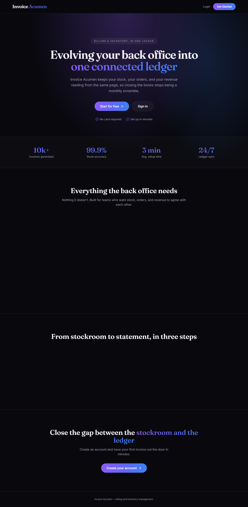
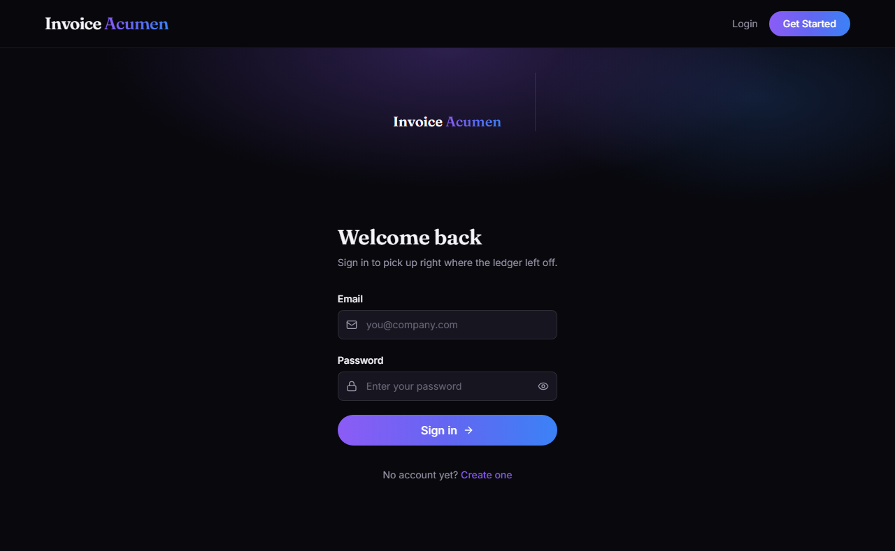

# Invoice Acumen

Full-stack invoice/billing & inventory management system.

Stack: React (Vite + Tailwind) frontend, Spring Boot 3 (Java 17) backend, MySQL database.
No payment gateway (Razorpay etc.) is used — payment methods are recorded manually (COD / UPI / Bank Transfer) and marked paid by the admin.

## Folder structure
- `backend/` — Spring Boot API (Maven project)
- `frontend/` — React app (Vite)

## Local setup

Prerequisites: Node.js 18+, Java 17+, Maven, and Docker Desktop.

1. Copy `.env.example` to `.env`, then replace all placeholder passwords and the JWT secret.
2. Start MySQL:
   ```powershell
   npm run db:up
   ```
3. Export the same database settings for the Spring Boot process. In PowerShell:
   ```powershell
   $env:DB_USERNAME = "invoice_app"
   $env:DB_PASSWORD = "your-value-from-dotenv"
   $env:JWT_SECRET = "your-random-32-character-minimum-secret"
   ```
4. Install all JavaScript dependencies and start both services:
   ```powershell
   npm run setup
   npm run dev
   ```

The preflight check verifies that MySQL is reachable before starting either service. The API runs at `http://localhost:8080`; the frontend runs at `http://localhost:5173`. If either process exits, the other is stopped too.

Use `npm run db:down` to stop the local database. Docker keeps database data in the named `invoice_acumen_mysql` volume.

## Configuration and production

- Never commit `.env` or real credentials.
- Use a random `JWT_SECRET` of at least 32 characters and set `SPRING_PROFILES_ACTIVE=prod` for production.
- The `prod` profile disables Hibernate schema mutation and requires explicit database, CORS, and JWT configuration.
- Flyway is enabled. Before a production deployment to a new database, replace the placeholder `V1__init.sql` with the complete baseline schema, then make schema changes through versioned Flyway migrations.
- SQL logging is off by default. Do not enable it in production because it can expose sensitive data.

## Key features
- JWT-based auth (register/login), role-based routing (CUSTOMER / ADMIN)
- Customer: browse products, cart, place orders, manage addresses, manage payment methods (no gateway), view order history
- Admin: revenue dashboard (weekly/monthly/yearly, chart), inventory/stock table with restock action, low-stock alerts, view & update all orders (status + payment status)

## UI screenshots




## Notes / next steps

- Request validation and refresh-token support are already included. Add automated tests for authentication, permissions, and order workflows before deployment.
- Implement password-reset tokens with expiry and email delivery before offering password recovery.
- Add pagination and filtering to product and order endpoints before the data set grows.
- Build an audited, administrator-only user-role management screen/API. Do not grant roles by manually changing production database rows.
- Run `npm audit` regularly and update dependencies after reviewing the impact of each fix.
